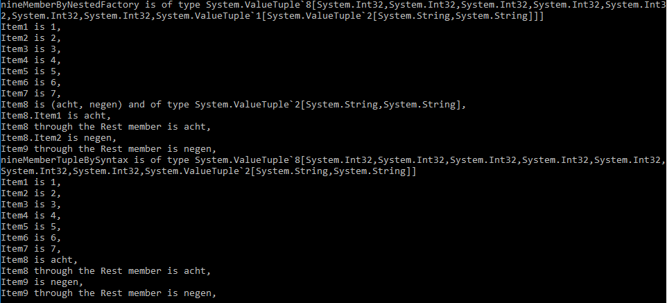
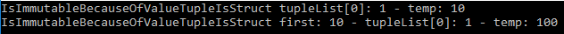

# Tuples in C#

## What are tuples and why would you need them?

Tuples are a language construct which allows for the ad-hoc, ordered grouping of some values. Where a class allows to group several values, it is used more when this grouping has to be re-used and you also want to attach behaviour to these values. A tuple however allows to group some values "on the spot" and then to never use that grouping again.

Tuples are sometimes also compared with a list of values, where the values can be given names and their type is fixed.

## There are `Tuple`s and there are `ValueTuple`s

The main difference between a `Tuple` and a `ValueTuple` is that the `Tuple` type is a reference type, while the `ValueTuple` is a value type.

As a quick refresher, the main difference between a reference type and a value type is that the reference type is created on the heap and its lifetime is thus controlled through garbage collection, while a value type is created on the stack and its lifetime is controlled by the variable scope.

Another difference is when variables are passed to methods: reference types are by default passed by reference while value types are passed by value. What this means in the end is that the content of what is referenced by a reference type can be changed in this method, while this is not true for value types: their content is copied when passed to a method. You can see this demonstrated in the code in the class `QuickRefresh_ReferenceTypeVsValueType`:

[The code](https://github.com/sergedesmedt/CSharpLanguageFeatures/blob/master/ValueTuples/QuickRefreshValueTypes/QuickRefresh_ReferenceTypeVsValueType.cs)
```csharp
 public struct SomeValueType {
     public string TheValue;
 }

 public class SomeReferenceType {
     public string TheValue;
 }

 public class QuickRefresh_ReferenceTypeVersusValueType
 {
     public static void MethodWithValueTypeArg(SomeValueType vType) {
         vType.TheValue = "New value inside MethodWithValueTypeArg";
         Console.WriteLine("After changing inside MethodWithValueTypeArg we have: " 
             + vType.TheValue);
     }

     public static void MethodWithReferenceTypeArg(SomeReferenceType rType) {
         rType.TheValue = "New value inside MethodWithValueTypeArg";
         Console.WriteLine("After changing inside MethodWithReferenceTypeArg we have: " 
             + rType.TheValue);
     }
 }
```

So, if we execute following code:
```csharp
SomeValueType vType = new SomeValueType() { 
    TheValue  = "vType.TheValue: Value before message call" 
};
Console.WriteLine("vType.TheValue original value is: " + vType.TheValue);

SomeReferenceType rType = new SomeReferenceType() { 
    TheValue = "rType.TheValue: Value before message call" 
};
Console.WriteLine("rType.TheValue original value is: " + rType.TheValue);

QuickRefresh_ReferenceTypeVersusValueType.MethodWithValueTypeArg(vType);
Console.WriteLine("vType.TheValue value after method call is: " + vType.TheValue);

QuickRefresh_ReferenceTypeVersusValueType.MethodWithReferenceTypeArg(rType);
Console.WriteLine("rType.TheValue value after method call is: " + rType.TheValue);
```

We get the following output:


Notice how:
 - for the value type, the value before and after the method call are the same, allthough we changed the value given to the method, inside the method. This is because a copy was made before handing the value to the method and inside the method only this copy was changed.
 - for the reference type, the value after the method call is the same as the changed value in the method: no copy was made but a reference to the value was given to the method. The method operated on the same instance as was given to the method.

There are a few consequences which result from this choice, but we will handle them when we are on the subject. So just remember that the old style `Tuple`s are reference types, thus a `class`,  and the new style `ValueTuple`s are value types, thus a `struct`.

## Tuple Definition

As mentioned above, a tuple (regardless of being a reference `Tuple` or `ValueTuple`) is an ordered "list" of values with different types.

### About *different types*

#### Type definition for Reference tuples

To support different types for the items in a `Tuple`, and to have them strongly typed (not "just" `objects`), the .NET Framework uses generics to define reference `Tuple`s

```csharp
public class Tuple<T1>;
public class Tuple<T1,T2>;
public class Tuple<T1,T2,T3>;
// More definitions ...
public Tuple<T1,T2,T3,T4,T5,T6,T7,TRest>
```

Each generic argument can be a different type. This allows the creation of tuples like:
```csharp
Tuple<int> ...
Tuple<int,char> ...
Tuple<char, int> ...
Tuple<int,MyOwnDefinedClass,string> ...
```

#### Type definition for Value tuples

Here also generics are used to define the `ValueTuple`

```csharp
public struct ValueTuple<T1>;
public struct ValueTuple<T1,T2>;
public struct ValueTuple<T1,T2,T3>;
// More definitions ...
public struct ValueTuple<T1,T2,T3,T4,T5,T6,T7,TRest>
```

Again, each generic argument can be a different type. This allows the creation of tuples like:
```csharp
ValueTuple<int> ...
ValueTuple<int,char> ...
ValueTuple<char, int> ...
ValueTuple<int,MyOwnDefinedClass,string> ...
```

### About *ordered list*

#### Type definition for Reference tuples

The members of the tuple form an ordered list. For this, the type arguments are mapped to the access members by ordinal position:

```csharp
public class Tuple<T1>;
public class Tuple<T1,T2>;
public class Tuple<T1,T2,T3>;
// More definitions ...
public Tuple<T1,T2,T3,T4,T5,T6,T7,TRest>
```

Each generic argument maps to a getter by its ordinal position: `T1` maps to `Item1` getter, `T2` to `Item2` getter, etc...
```csharp
public class Tuple<T1> {
    public T1 Item1 { get; }
};
public class Tuple<T1,T2> {
    public T1 Item1 { get; }
    public T2 Item2 { get; }
};
public class Tuple<T1,T2,T3> {
    public T1 Item1 { get; }
    public T2 Item2 { get; }
    public T3 Item3 { get; }
};
```

#### Type definition for Value tuples

A similar thing can be said about `ValueTuple`s, however fields are used and not property getters. (We'll discuss this fact later)

```csharp
public struct ValueTuple<T1>;
public struct ValueTuple<T1,T2>;
public struct ValueTuple<T1,T2,T3>;
// More definitions ...
public struct ValueTuple<T1,T2,T3,T4,T5,T6,T7,TRest>
```

Each generic argument maps to a field by its ordinal position: `T1` maps to `Item1` field, `T2` to `Item2` field, etc...
```csharp
public class Tuple<T1> {
    public T1 Item1;
};
public class Tuple<T1,T2> {
    public T1 Item1;
    public T1 Item1;
};
public class Tuple<T1,T2,T3> {
    public T1 Item1;
    public T2 Item2;
    public T3 Item3;
};
```

## Tuple Creation

There are a few ways you can create tuples and following sections will give a summary of the available options.

### By Constructor
The most classical way of creating tuples is of course by using the constructor. As mentioned above, both tuple types are generic classes in which the generic parameters specify the type of the data items in the tuple.

Constructors are provided to create tuples containing up to 8 items. By using the construtor, you may have to specify up to eight types for the generic parameters.

Following examples create tuples with 2 data items of type `int` and `string` respectively.

#### Syntax for Reference tuples

[The code](https://github.com/sergedesmedt/CSharpLanguageFeatures/blob/master/ValueTuples/DoItWithOrdinaryTuples.cs#L12-L14)
```csharp
Tuple<int, string> myTuple = new Tuple<int, string>(10, "tien");
```
#### Syntax for Value tuples

[The code](https://github.com/sergedesmedt/CSharpLanguageFeatures/blob/master/ValueTuples/DoItWithValueTuples.cs#L12-L14)
```csharp
ValueTuple<int, string> myValueTuple = new ValueTuple<int, string>(10, "tien");
``` 


### By Factory Method
Of course, having to specify up to eight generic parameters can lead to a very verbose syntax. The .NET library provides a basic type without any generic parameters but with several factory methods for each kind of tuple.

Following is an example of the factory method for a tuple with three data items. The type of the tuples data items is deduced by the compiler using generic parameter inference.

#### Syntax for Reference tuples

[The code](https://github.com/sergedesmedt/CSharpLanguageFeatures/blob/master/ValueTuples/DoItWithOrdinaryTuples.cs#L16-L18)
```csharp
var myTuple = Tuple.Create(10, "tien");
```
#### Syntax for Value tuples

[The code](https://github.com/sergedesmedt/CSharpLanguageFeatures/blob/master/ValueTuples/DoItWithValueTuples.cs#L16-L18)
```csharp
var myValueTuple = ValueTuple.Create(10, "tien");
``` 

### By Syntax Convention
Allthough the factory method already gives us a more terse syntax, with the new `ValueTuple` type we have an even more terse syntax, unsupported for regular reference `Tuple`s.
This new syntax also gives the opportunity to access the members of the tuple with a chosen name, instead of the generic `Item1`, `Item2`, etc...

#### Syntax for Value tuples

[The code](https://github.com/sergedesmedt/CSharpLanguageFeatures/blob/master/ValueTuples/DoItWithValueTuples.cs#L20-L36)
```csharp
var myValueTuple = (10, "tien");
var myNamedMemberValueTuple = (theNumber: 10, theText: "tien");
Console.WriteLine($"The number is {myNamedMemberValueTuple.theNumber}"
	+ $" and the text is {myNamedMemberValueTuple.theText}");

// You do not have to supply new names for all members
var partialNaming = (theNumber: 10, "tien");
Console.WriteLine($"The number is {partialNaming.theNumber} and the text is {partialNaming.Item2}");
// You can re-use the generic names, but only if they are at the correct position
var atSpecificPosition = (theNumber: 10, Item2: "tien");
Console.WriteLine($"The number is {atSpecificPosition.theNumber} and the text is {atSpecificPosition.Item2}");
// Following will not compile: you can only use the ItemX names at the position they are "designed" for. So the "Item2" name can only be used at the second position (see above)
//var itemCannotBeUsedAtIllegalPosition = (Item2: 10, "tien");
``` 

We get the following output:


Notice how:
 - The syntax for naming and giving values is to seperate them with a colon (`:`) instead of the regular assignment (`=`) used for defining properties and assigning values to them.
 - You do not have to supply names for each member. If you do not supply a name, then the usual `ItemX` name is used to access that member.
 - You can use the default name, but only when you use it at the same position as it would appear normally. So you cannot use the `Item2` name at position 1.

#### Under the hood
Those of you who are proficient with Linq might be under the impression that under the hood an anonymous type is created. However, you would be wrong. This naming is handled exclusively by the compiler.
Using [ILSpy](https://github.com/icsharpcode/ILSpy) we can see what the above code eventually gets compiled to (using C# 6.0 syntax):

```csharp
ValueTuple<int, string> myValueTuple = new ValueTuple<int, string>(10, "tien");  
ValueTuple<int, string> myNamedMemberValueTuple = new ValueTuple<int, string>(10, "tien");
Console.WriteLine($"The number is {myNamedMemberValueTuple.Item1}"
	+ $" and the text is {myNamedMemberValueTuple.Item2}");  
``` 
Notice how:
 - The creation of the `ValueTuple` with unnamed and named values eventually compiles to exactly the same code.
 - The named values in the `WriteLine` call end up as calls to the regular `Item1` and `Item2` fields

*A note here: this does NOT really get compiled to this code. We all know the code gets compiled to IL-code. However, if you would decompile this IL-code to the C# 6.0 syntax, the above code is what you would get. So, a more correct statement would be: "the code gets compiled into IL-code similar to following C# 6.0 code"*

So, allthough the readability of the code is greatly enhanced by using named values, under the hood nothing has changed.

### At Infinitum
Another difference between the new `ValueTuple` and the old reference `Tuple` is in the number of items we can define and the way to access them. If you look into the documentation for both types, you will find constructors for up to 8 items. However, the ValueTuple creation through syntax has a compiler supported way of enabling more items.

Let's see what is possible and what is not.

#### Syntax for Reference tuples
[The code](https://github.com/sergedesmedt/CSharpLanguageFeatures/blob/master/ValueTuples/DoItWithOrdinaryTuples.cs#L20-L78)
```csharp
var sevenMemberByConstructor = new Tuple<int, int, int, int, int, int, int>(1, 2, 3, 4, 5, 6, 7);
var sevenMemberByFactory = Tuple.Create(1, 2, 3, 4, 5, 6, 7);

// Allthough following will compile, it will not run. An exception will be thrown
//  System.ArgumentException: 'The last element of an eight element tuple must be a Tuple.'
//var eightMemberTupleWithConstructor = new Tuple<int, int, int, int, int, int, int, int>(1, 2, 3, 4, 5, 6, 7, 8);

var eightMemberByFactory = Tuple.Create(1, 2, 3, 4, 5, 6, 7, 8);
Console.WriteLine($"Item1 is {eightMemberByFactory.Item1},"
// ... more code here in the source files ...
// There is no Item8 member
// + $"Item8 is {eightMemberByFactory.Item8},"
+ $"Rest.Item1 has the value of the 8th argument {eightMemberByFactory.Rest.Item1},"
);

// There is no old-school tuple with nine members
//var nineMemberTupleAttempt1 = Tuple.Create(1, 2, 3, 4, 5, 6, 7, 8, 9);
//var nineMemberTupleAttempt2 = Tuple<int, int, int, int, int, int, int, int, int>(1, 2, 3, 4, 5, 6, 7, 8, 9);

// To specify more then eight members, we need to use nested tuples
var tenMemberTupleByConstructor = new Tuple<int, int, int, int, int, int, int, Tuple<string, string, string>>(1, 2, 3, 4, 5, 6, 7, new Tuple<string, string, string>("een", "twee", "drie"));
Console.WriteLine($"Item1 is {tenMemberTupleByConstructor.Item1},"
// ... more code here in the source files ...
+ $"Rest.Item1 is {tenMemberTupleByConstructor.Rest.Item1},"
// ... more code here in the source files ...
);

// As seen above, a strange thing happens using the factory method though:
// The resulting type is Tuple<int, int, int, int, int, int, int, Tuple<Tuple<string, string, string>>>
var tenMemberTuple = Tuple.Create(1, 2, 3, 4, 5, 6, 7, Tuple.Create("een", "twee", "drie"));

// Accessing the 8th, 9th and 10th tuple member is done through the Rest.Item1 member
Console.WriteLine($"Item1 is {tenMemberTuple.Item1},"
// ... more code here in the source files ...
+ $"Rest.Item1.Item1 is {tenMemberTuple.Rest.Item1.Item1},"
// ... more code here in the source files ...
);
```
For the reference Tuples with eight members, following is the output:


For the reference Tuples with ten members, following is the output:


As long as we only use seven or less members nothing special is happening.

However, the eighth argument to the constructor with eight arguments is foreseen to be used exclusively for `Tuple`s with more than seven members. 

When using the constructor directly you must specify a `Tuple` type for the eighth argument, no other type will be accepted. You can then access the members of this `Tuple` through the `Rest` member: `Rest.Item1`, `Rest.Item2`, etc...

When using the factory method, the eighth argument is wrapped inside a `Tuple` by the factory method. As a result, when specifying a nested `Tuple` for the factory method, you must access it through the `Rest.Item1` member and the members of the `Tuple` through `Rest.Item1.Item1`, `Rest.Item1.Item2`, etc... depending on the number of members specified, which is of course odd.

#### Syntax for Value tuples
[The code](https://github.com/sergedesmedt/CSharpLanguageFeatures/blob/master/ValueTuples/DoItWithValueTuples.cs#L38-L117)
```csharp
var sevenMemberByConstructor = new ValueTuple<int, int, int, int, int, int, int>(1, 2, 3, 4, 5, 6, 7);
var sevenMemberByFactory = ValueTuple.Create(1, 2, 3, 4, 5, 6, 7);
var sevenMemberTuple = (1, 2, 3, 4, 5, 6, 7);

// Allthough following will compile, it will not run. An exception will be thrown
//  System.ArgumentException: 'The last element of an eight element ValueTuple must be a ValueTuple.'
//var eightMemberByConstructor = new ValueTuple<int, int, int, int, int, int, int, int>(1, 2, 3, 4, 5, 6, 7, 8);

// Allthough the eight member ValueTuple does not contain an Item8 member, the compiler acts as if it does
var eightMemberByFactory = ValueTuple.Create(1, 2, 3, 4, 5, 6, 7, "acht");
Console.
    WriteLine($"eightMemberByFactory is of type {eightMemberByFactory.GetType()}"
    // ... more code here in the source files ...
    + $"Item8 is {eightMemberByFactory.Item8} and of type {eightMemberByFactory.Item8.GetType()}: it is the eighth argument,"
    + $"Argument 8 through the Rest member is {eightMemberByFactory.Rest.Item1},"
    );

var eightMemberTuple = (1, 2, 3, 4, 5, 6, 7, "acht");
Console.
    WriteLine($$"eightMemberTuple is of type {eightMemberTuple.GetType()}"
    + $"Item1 is {eightMemberTuple.Item1},"
    // ... more code here in the source files ...
    + $"Item8 is {eightMemberTuple.Item8} and of type {eightMemberTuple.Item8.GetType()}: it is the eighth argument,"
    + $"Item8 through the Rest member is {eightMemberTuple.Rest.Item1},"
    );

// Following will not compile
//var nineMemberByConstructor = new ValueTuple<int, int, int, int, int, int, int, int, int>(1, 2, 3, 4, 5, 6, 7, 8, 9);
//var nineMemberByFactory = ValueTuple.Create(1, 2, 3, 4, 5, 6, 7, 8, 9);

var nineMemberByNestedFactory = ValueTuple.Create(1, 2, 3, 4, 5, 6, 7, ValueTuple.Create("acht", "negen"));
Console.WriteLine($"nineMemberByNestedFactory is of type {nineMemberByNestedFactory.GetType()}"
    + $"Item1 is {nineMemberByNestedFactory.Item1},"
    // ... more code here in the source files ...
    // We are accessing the ValueTupe here and NOT the string "acht" !!!!
    + $"Item8 is {nineMemberByNestedFactory.Item8} and of type {nineMemberByNestedFactory.Item8.GetType()},"
    + $"Item8 is {nineMemberByNestedFactory.Item8.Item1},"
    + $"Item8 through the Rest member is {nineMemberByNestedFactory.Rest.Item1.Item1},"
    //+ $"Item9 is {nineMemberByNestedFactory.Item9},"
    + $"Item9 is {nineMemberByNestedFactory.Item8.Item2},"
    + $"Item9 through the Rest member is {nineMemberByNestedFactory.Rest.Item1.Item2},"
    );

// We can proceed adding members, but only using the syntax convention
var nineMemberTupleAttempt1 = (1, 2, 3, 4, 5, 6, 7, "acht", "negen");
// We can access them all with the regular ItemX syntax
Console.WriteLine($"nineMemberTupleBySyntax is of type {nineMemberTupleBySyntax.GetType()}"
    + $"Item1 is {nineMemberTupleBySyntax.Item1},"
    // ... more code here in the source files ...
    // We are accessing the string "acht" here and NOT the ValueTupe !!!!
    + $"Item8 is {nineMemberTupleBySyntax.Item8},"
    + $"Item8 through the Rest member is {nineMemberTupleBySyntax.Rest.Item1},"
    + $"Item9 is {nineMemberTupleBySyntax.Item9},"
    + $"Item9 through the Rest member is {nineMemberTupleBySyntax.Rest.Item1},"
    );
```
For the ValueTuples with eight members, following is the output:


For the ValueTuples with nine members, following is the output:



Here also, with 7 or less members, nothing special is happening.

When using eight members, we can no longer use the constructor: the eighth argument of the constructor can only be a `ValueTuple`, and is exclusively foreseen for nesting  `ValueTuple`s. Though your code will compile, it will throw an exception at runtime.

However, we can use the factory method and also the creation through syntax convention. 

The factory method only works directly for eight member `ValueTuple`s. If you want to create nine member `ValueTuple`s with the factory method, you'll need to supply a nested `ValueTuple` for the last argument.

When usin the syntax convention for creation, the compiler knows how to deal with accessing members beyond `Item7` through the names `Item8`, `Item9`, etc... You can also access them through their real names `Rest.Item1`, `Rest.Item2`, etc...


#### Under the hood

The above calls actually get compiled into following code (using C# 6.0 syntax)

```csharp
ValueTuple<int, int, int, int, int, int, int> sevenMemberByConstructor = new ValueTuple<int, int, int, int, int, int, int>(1, 2, 3, 4, 5, 6, 7);
ValueTuple<int, int, int, int, int, int, int> sevenMemberByFactory = ValueTuple.Create(1, 2, 3, 4, 5, 6, 7);
ValueTuple<int, int, int, int, int, int, int> sevenMemberTuple = new ValueTuple<int, int, int, int, int, int, int>(1, 2, 3, 4, 5, 6, 7);
ValueTuple<int, int, int, int, int, int, int, ValueTuple<string>> eightMemberByFactory = ValueTuple.Create(1, 2, 3, 4, 5, 6, 7, "acht");
ValueTuple<int, int, int, int, int, int, int, ValueTuple<string>> eightMemberTuple = new ValueTuple<int, int, int, int, int, int, int, ValueTuple<string>>(1, 2, 3, 4, 5, 6, 7, new ValueTuple<string>("acht"));
ValueTuple<int, int, int, int, int, int, int, ValueTuple<ValueTuple<string, string>>> nineMemberByNestedFactory = ValueTuple.Create(1, 2, 3, 4, 5, 6, 7, ValueTuple.Create("acht", "negen"));
ValueTuple<int, int, int, int, int, int, int, ValueTuple<string, string>> nineMemberTupleBySyntax = new ValueTuple<int, int, int, int, int, int, int, ValueTuple<string, string>>(1, 2, 3, 4, 5, 6, 7, new ValueTuple<string, string>("acht", "negen"));
```
Notice how:
- creation through the constructor and factory method gets compiled to a respective constructor call and a call of the factory method.
- creation through syntax convention of tuples with less then 8 members gets compiled to a constructor call
- creation through syntax of a `ValueTuple` with 8 member already gets compiled to a nested tuple.
- creation through syntax of a `ValueTuple` with more than 8 member gets compiled to a nested tuple.

What may be surprising is the fact that the 8 member tuple is already compiled to a nested `ValueTuple`. However, when looking at the decompilation of this constructor it is not that surprising:

```csharp
public ValueTuple(T1 item1, T2 item2, T3 item3, T4 item4, T5 item5, T6 item6, T7 item7, TRest rest)
{
	if (!(((object)rest) is IValueTupleInternal))
	{
		throw new ArgumentException(SR.ArgumentException_ValueTupleLastArgumentNotAValueTuple);
	}
	Item1 = item1;
	Item2 = item2;
	Item3 = item3;
	Item4 = item4;
	Item5 = item5;
	Item6 = item6;
	Item7 = item7;
	Rest = rest;
}
```
Notice how:
 - the last member type is named `TRest`: a clear indication that it is meant to contain the remaining values of the lot.
 - inside the constructor, the last value is checked to be derived of `IValueTupleInternal`: it has to be a `ValueTuple`! If not, an `Exception` is thrown.

But then the question remains: how are these members accessed?

```csharp
Console.WriteLine(string.Format("Item1 is {0},", nineMemberTupleAttempt.Item1) 
    + string.Format("Item2 is {0},", nineMemberTupleAttempt.Item2) 
    + string.Format("Item3 is {0},", nineMemberTupleAttempt.Item3) 
    // More members here 
    + string.Format("Item7 is {0},", nineMemberTupleAttempt.Item7) 
    + string.Format("Item8 is {0},", nineMemberTupleAttempt.Rest.Item1) 
    + string.Format("Item9 is {0},", nineMemberTupleAttempt.Rest.Item2));
```
Notice how:
 - the eigth and nineth member are accessed through the `Rest` member of the `ValueTuple`


### Default Constructor
Finally, can we create a tuple with the default constructor? Let's find out.

#### Syntax for Reference tuples
[The code](https://github.com/sergedesmedt/CSharpLanguageFeatures/blob/master/ValueTuples/DoItWithOrdinaryTuples.cs#L80-L83)
```csharp
// Following does not compile
//Tuple<int, string> myTuple = new Tuple<int, string>();
```
Reference `Tuple`s are strictly readonly, meaning, there are no setters for the members. So a default constructor is not provided for this type because you cannot assign values to the members after construction. Reference `Tuple`s are immutable (see further).

#### Syntax for Value tuples
[The code](https://github.com/sergedesmedt/CSharpLanguageFeatures/blob/master/ValueTuples/DoItWithValueTuples.cs#L119-L122)
```csharp
ValueTuple<int, string> myTuple = new ValueTuple<int, string>();
```
`ValueTuple`s do support default construction because there members can be assigned. So `ValueTuple`s are NOT immutable (see further)!

## Immutability

If you search the internet for general information about tuples, you'll find that most tuples are immutable. That is, after creation they cannot be changed. Let's investigate this property.

### Member Assignment

#### Syntax for Reference tuples
[The code](https://github.com/sergedesmedt/CSharpLanguageFeatures/blob/master/ValueTuples/DoItWithOrdinaryTuples.cs#L89-L95)
```csharp
Tuple<int, string> myTuple = new Tuple<int, string>(10, "tien");

// Following does not compile: member assignment is not allowed
//myTuple.Item1 = 21;
//myTuple.Item2 = "twinig";
```
For reference `Tuple`s, the members cannot be assigned: they are C# *properties* with only a getter and no setter. They can only be given values during construction.

#### Syntax for Value tuples
[The code](https://github.com/sergedesmedt/CSharpLanguageFeatures/blob/master/ValueTuples/DoItWithValueTuples.cs#L128-L134)
```csharp
ValueTuple<int, string> myTuple = new ValueTuple<int, string>(10, "tien");

//Following does compile: member assignment is allowed
myTuple.Item1 = 21;
myTuple.Item2 = "twinig";
```
For `ValueTuple`s, the members can be assigned: they are merely *fields* in the struct a `ValueTuple` is and thus can be altered. But does this not break the immutability property of a tuple? Things aren't as bad as one might suspect.

### As Items in Generic Containers

#### Syntax for Reference tuples
[The code](https://github.com/sergedesmedt/CSharpLanguageFeatures/blob/master/ValueTuples/DoItWithOrdinaryTuples.cs#L97-L107)
```csharp
List<Tuple<int, string>> tupleList = new List<Tuple<int, string>>() {
    Tuple.Create(1, "een"),
    Tuple.Create(2, "twee"),
    Tuple.Create(3, "drie"),
};

// Following does not compile
//  Property or indexer 'Tuple<int, string>.Item1' cannot be assigned to --it is read only
//tupleList[0].Item1 = 10;
```
No surprises here: the items in a reference `Tuple` are not assignable, so they won't be in a list neither

#### Syntax for Value tuples
[The code](https://github.com/sergedesmedt/CSharpLanguageFeatures/blob/master/ValueTuples/DoItWithValueTuples.cs#L136-L165)
```csharp
List<(int, string)> myTupleList = new List<(int, string)>() {
    (1, "een"),
    (2, "twee"),
    (3, "drie"),
};

// Following does not compile
//  Cannot modify the return value of 'List<(int, string)>.this[int]' because it is not a variable 
//myTupleList[0].Item1 = 10;
```
Well, this may come as a surprise: the code for assigning the members of the tuple doesn't compile neither. The problem is that to return the value the C# compiler creates a temporary variable which contains a copy of the value in the list. But because this variable is temporary it cannot be changed. What is more, even the value added to the list is not really the created value, but rather a copy of the created value.

[The code](https://github.com/sergedesmedt/CSharpLanguageFeatures/blob/master/ValueTuples/DoItWithValueTuples.cs#L136-L165)
```csharp
var temp = myTupleList[0];
temp.Item1 = 10;
Console.WriteLine($"IsImmutableBecauseOfValueTupleIsStruct"
    + $" tupleList[0]: {myTupleList[0].Item1}"
    + $" - temp: {temp.Item1}");

var first = (1, "een");
List<(int, string)> myOtherTupleList = new List<(int, string)>() {
    first
};
first.Item1 = 10;
var temp2 = myOtherTupleList[0];
temp2.Item1 = 100;
Console.WriteLine($"IsImmutableBecauseOfValueTupleIsStruct" + 
	$" first: {first.Item1}" + 
	$" - tupleList[0]: {myOtherTupleList[0].Item1}" + 
	$" - temp: {temp2.Item1}");
```
We get the following output:



#### Under the hood
So, how does this work under the hood? Let's see what this gets compiled to using C# 1.0 syntax:
```csharp
List<ValueTuple<int, string>> list = new List<ValueTuple<int, string>>();  
list.Add(new ValueTuple<int, string>(1, "een"));  
list.Add(new ValueTuple<int, string>(2, "twee"));  
list.Add(new ValueTuple<int, string>(3, "drie"));  
List<ValueTuple<int, string>> myTupleList = list;  

ValueTuple<int, string> temp = myTupleList[0];  
temp.Item1 = 10;  
Console.WriteLine(string.Format("IsImmutableBecauseOfValueTupleIsStruct tupleList[0]: {0} - temp: {1}", myTupleList[0].Item1, temp.Item1));  

ValueTuple<int, string> first = new ValueTuple<int, string>(1, "een");  
List<ValueTuple<int, string>> list2 = new List<ValueTuple<int, string>>();  
list2.Add(first);  
List<ValueTuple<int, string>> myOtherTupleList = list2;  
first.Item1 = 10;  
ValueTuple<int, string> temp2 = myOtherTupleList[0];  
temp2.Item1 = 100;  
Console.WriteLine(string.Format("IsImmutableBecauseOfValueTupleIsStruct first: {0} - tupleList[0]: {1} - temp: {2}", first.Item1, myOtherTupleList[0].Item1, temp2.Item1));
```
There is not much to notice here, apart from the fact that the initialization list gets compiled in calls to the `List` `Add` method.
The magic however is in the implemetation of a generic `List<T>` for value types. Where a generic `List<T>` for reference types stores the references to the objects it contains, a generic `List<T>` for value types stores the values themselves: the storage inside the `List<T>` is an `T[]` array and when you add a value type, its content is copied into this array. You can see this in the `WriteLine` statements for the `myOtherTupleList` list:
 - Changing the value of `first.Item1` after adding it to the `List` does not change the value of the `Item1` member of the first member of the `List`: when adding the variable `first` to the list its contents where copied into the List.
 - When getting the first member of the `List` and changing its `Item1` value, this does not change the value of the first member of the `List`, and neither does it change the content of the variable `first`.

### As Return type or Argument to/from a Method

#### Syntax for Reference types
Nothing special here: the Tuple is immutable, and thus we cannot change it

#### Syntax for Value types
[The code](https://github.com/sergedesmedt/CSharpLanguageFeatures/blob/master/ValueTuples/DoItWithValueTuples.cs#L167-L190)
```csharp
public static ValueTuple<int, string> ActionOnTuple(
	ValueTuple<int, string> tuple, 
	ref ValueTuple<int, string> refTuple
	) {
    Console.WriteLine($"ActionOnTuple.ValueTuple - tuple item1: {tuple.Item1} - item2: {tuple.Item2}");
    tuple.Item1 = 12;
    tuple.Item2 = "twaalf";
    Console.WriteLine($"ActionOnTuple.ValueTuple -tuple  item1: {tuple.Item1} - item2: {tuple.Item2}");

    Console.WriteLine($"ActionOnTuple.ValueTuple - refTuple item1: {refTuple.Item1} - item2: {refTuple.Item2}");
    refTuple.Item1 = 22;
    refTuple.Item2 = "tweeentwintig";
    Console.WriteLine($"ActionOnTuple.ValueTuple - refTuple item1: {refTuple.Item1} - item2: {refTuple.Item2}");

    return tuple;
}

var tuple = (11, "elf");
var byRefTuple = (21, "eenentwintig");
Console.WriteLine($"Tuple.ValueTuple - tuple item1: {tuple.Item1} - item2: {tuple.Item2}");
Console.WriteLine($"Tuple.ValueTuple - byRefTuple item1: {byRefTuple.Item1} - item2: {byRefTuple.Item2}");
var returnTuple = ActionOnTuple(tuple, ref byRefTuple);
Console.WriteLine($"Tuple.ValueTuple - tuple after item1: {tuple.Item1} - item2: {tuple.Item2}");
Console.WriteLine($"Tuple.ValueTuple - byRefTuple after item1: {byRefTuple.Item1} - item2: {byRefTuple.Item2}");
Console.WriteLine($"Return.ValueTuple - returnTuple item1: {returnTuple.Item1} - item2: {returnTuple.Item2}");
```

Because of the pass-by-value / copy semantics of value types, when passing a `ValueTupe` as a parameter to a method  or returning a `ValueTuple` from a method, a copy is made so we cannot change the members of the object passed as an argument to the method, from inside the method.

However, when passing the parameter by `ref` then we can change the value inside the method. That is the whole purpose of passing parameters by `ref`: to be able to change the value.

So, if we execute the above code we get the following output in the console:


Notice how:
 - for the argument passed by value (the first argument), after calling the action which changes the values passed to it, the original values in the calling method are left unchanged.
 - for the argument passed by reference (the second argument), after calling the action which changes the values passed to it, the original values in the calling method are changed.
 - for the return value, the original value passed into the action remains unchanged. Actually, there are two copies being made here:
	 1. A first copy is being made when passing the `ValueTuple` as an argument to the method
	 2. A second copy is being made when passing the return value back to the calling method. 

## Identity and Equality

Let us first talk about the difference between equality and identity:
- Identity (or reference equality) refers to the fact that two variables refer to the same object in memory.
- Equality (or value equality) refers to the fact that two variables or objects refer to the same "thing": the values of the objects they refer to are the same.

As such, if two different instances of a class have the same values for their data members, they have a different identity but can be equal. In the reference section below you can find a link to a codeproject article which explains it very well.

### Identity and Equality of variables

The differences in identity and equality between ordinary reference `Tuple`s and `ValueTuple`s basically boil down to the differences which exist for reference types and value types.

#### Behaviour for Reference tuples
[The code](https://github.com/sergedesmedt/CSharpLanguageFeatures/blob/master/ValueTuples/DoItWithOrdinaryTuples.cs#L127-L139)
```csharp
var myTuple1 = new Tuple<int, string>(10, "tien");
var myTuple2 = new Tuple<int, string>(10, "tien");
var myTuple3 = myTuple1;

Console.WriteLine($"myTuple1 equals myTuple2: {Object.Equals(myTuple1, myTuple2)}");
Console.WriteLine($"myTuple1 equals myTuple2: {Object.ReferenceEquals(myTuple1, myTuple2)}");

Console.WriteLine($"myTuple1 equals myTuple3: {Object.Equals(myTuple1, myTuple3)}");
Console.WriteLine($"myTuple1 equals myTuple3: {Object.ReferenceEquals(myTuple1, myTuple3)}");
```

We get the following output:


Notice how:
- Two instances of tuples of the same type do not have reference equality but do have value equality.
- If assigning one instance to another variable, then we have for these variables both reference and value equality.

#### Behaviour for Value tuples
[The code](https://github.com/sergedesmedt/CSharpLanguageFeatures/blob/master/ValueTuples/DoItWithValueTuples.cs#L196-L208)
```csharp
var myTuple1 = (10, "tien");
var myTuple2 = (10, "tien");
var myTuple3 = myTuple1;

Console.WriteLine($"myTuple1 equals myTuple2: {Object.Equals(myTuple1, myTuple2)}");
Console.WriteLine($"myTuple1 equals myTuple2: {Object.ReferenceEquals(myTuple1, myTuple2)}");

Console.WriteLine($"myTuple1 equals myTuple3: {Object.Equals(myTuple1, myTuple3)}");
Console.WriteLine($"myTuple1 equals myTuple3: {Object.ReferenceEquals(myTuple1, myTuple3)}");
```

We get the following output:


Notice how:
- Two instances of tuples of the same type do not have reference equality but do have value equality.
- If assigning one instance to another variable, then for these variables we still don't have reference equality.

This last remark is a direct consequence of the value semantics of valuetypes.

### Equality and Immutability
What is the influence of changing variables on the equality

#### Behaviour for Reference tuples
Not much to discuss here: you can't change reference tuples. Once they are instantiated they always keep the same values

#### Behaviour for Value tuples
We've seen that `ValueTuple`s are not immutable. So, if we change the value of one of the data items in a `ValueTuple`, then what is the effect on the equality?

[The code](https://github.com/sergedesmedt/CSharpLanguageFeatures/blob/master/ValueTuples/DoItWithValueTuples.cs#L210-L222)
```csharp
var myTuple1 = (10, "tien");
var myTuple3 = myTuple1;

Console.WriteLine($"myTuple1 equals myTuple3: {Object.Equals(myTuple1, myTuple3)}");
Console.WriteLine($"myTuple1 equals myTuple3: {Object.ReferenceEquals(myTuple1, myTuple3)}");

myTuple3.Item1 = 11;

Console.WriteLine($"myTuple1 equals edited myTuple3: {Object.Equals(myTuple1, myTuple3)}");
Console.WriteLine($"myTuple1 equals edited myTuple3: {Object.ReferenceEquals(myTuple1, myTuple3)}");
```

We get the following output:


Notice how:
- if we change one of the data items equality no longer holds. Which was of course to be expected.

## Tuple Deconstruction
C# 7.0 also has a syntax for deconstructing classes into there composing values. You can do this by providing a so called Deconstructor. Fortunately for us, the .NET framework provides Deconstructors out of the box for reference `Tuple`s and for `ValueTuple`s. 

### Basic introduction or Quick refresh
Following is a simple refresh on Deconstruction. It is not my intention to provide a full explanation of how Deconstruction exactly works, but rather to give, for those unfamilliar with it, a basic intro so you can understand the examples discussed in the context of tuples, or for those needing a quick refresh, a quick refresh on the syntax and what makes it work.

#### Constructors
We all know constructors of classes: they provide a point of initialization for the members of the class. They allow you to provide initial values for the members. Those values can be defined in the constructor themselves, or they can be provided to the constructor as parameters in the constructor call:

[The code](https://github.com/sergedesmedt/CSharpLanguageFeatures/blob/master/ValueTuples/QuickRefreshDeconstruction/ClassWithConstructors.cs#L6-L26)
```csharp
public class ClassWithConstructors {
    public ClassWithConstructors() {
        PropertyOfTypeInt = 0;
        PropertyOfTypeString = "Initialized with fixed value in consructor";
    }

    public ClassWithConstructors(int externalValueForInt, string externalValueForString) {
        PropertyOfTypeInt = externalValueForInt;
        PropertyOfTypeString = externalValueForString;
    }

    public int PropertyOfTypeInt {
        get;
        set;
    }

    public string PropertyOfTypeString {
        get;
        set;
    }
}
```
[The code](https://github.com/sergedesmedt/CSharpLanguageFeatures/blob/master/ValueTuples/QuickRefreshDeconstruction/QuickRefresh_Deconstruction.cs#L8-L20)
```csharp
var theDefaultConstructedObject = new ClassWithConstructors();
Console.WriteLine("Default constructed object has values >"+
    $" PropertyOfTypeInt: {theDefaultConstructedObject.PropertyOfTypeInt}" +
    $" PropertyOfTypeString: {theDefaultConstructedObject.PropertyOfTypeString}");

int externalValueForInt = 10;
string externalValueForString = "External value for the string property";
var theCustomConstructedObject = new ClassWithConstructors(externalValueForInt, externalValueForString);
Console.WriteLine("Object constructed with provided values, has values >" +
    $" PropertyOfTypeInt: {theCustomConstructedObject.PropertyOfTypeInt}" +
    $" PropertyOfTypeString: {theCustomConstructedObject.PropertyOfTypeString}");
```
Another way of looking at the process of providing parameters to the constructor is that we group some values, those provided to the constructor, into some object, the properties of the class of the object.

But, what if we wanted to "un-group" those properties back into seperate values? Well, for that we can now provide a deconstructor.

#### Deconstructor
Deconstructors provide for the opposite operation: they allow to decompose/deconstruct an object of a class into its seperate components by assigning them to seperate variables. For that we define a `Deconstructor` for the class:

[The code](https://github.com/sergedesmedt/CSharpLanguageFeatures/blob/master/ValueTuples/QuickRefreshDeconstruction/ClassWithDeconstructor.cs#L6-L26)
```csharp
public class ClassWithDeconstructor {
    public ClassWithDeconstructor(int externalValueForInt, string externalValueForString) {
        PropertyOfTypeInt = externalValueForInt;
        PropertyOfTypeString = externalValueForString;
    }

    public void Deconstruct(out int holderForInt, out string holderForString) {
        holderForInt = PropertyOfTypeInt;
        holderForString = PropertyOfTypeString;
    }

    public int PropertyOfTypeInt {
        get;
        set;
    }

    public string PropertyOfTypeString {
        get;
        set;
    }
}
```
[The code](https://github.com/sergedesmedt/CSharpLanguageFeatures/blob/master/ValueTuples/QuickRefreshDeconstruction/QuickRefresh_Deconstruction.cs#L22-L34)
```csharp
int externalValueForInt = 10;
string externalValueForString = "External value for the string property";
var theCustomConstructedObject = new ClassWithDeconstructor(externalValueForInt, externalValueForString);
Console.WriteLine("Object constructed with provided values, has values >" +
                $" PropertyOfTypeInt: {theCustomConstructedObject.PropertyOfTypeInt}" +
                $" PropertyOfTypeString: {theCustomConstructedObject.PropertyOfTypeString}");

(var targetForInt, var targetForString) = theCustomConstructedObject;
Console.WriteLine("The decomposition of the object results in following values >" +
                $" targetForInt: {targetForInt}" +
                $" targetForString: {targetForString}");
```


Notice how:
 - The Deconstructor always has the name `Deconstructor`!
 - For the printing of the properties of the class, we have to use the dot-syntax for class members: the variable name of the object, a dot and finally the name of the property
 - For the printing of the decomposed values, we can simply use the names of the variables. There is no need to provide the name of the variable referencing the object: the variables into which the object was deconstructed are just plain variables. They are not members of any object (at least not with the syntax used)

### Deconstruction into variables
As mentioned above, deconstruction allows the capturing of the various components of a class/struct into seperate variables. Deconstruction can be done into new variables, existing variables, ignoring certain components, etc... In this article we will focus on Deconstruction into new variables, not ignoring any components.

#### Syntax for Reference tuples
[The code](https://github.com/sergedesmedt/CSharpLanguageFeatures/blob/master/ValueTuples/DoItWithOrdinaryTuples.cs#L145-L149)
```csharp
var theTuple = Tuple.Create(11, "elf");
var (theNumber, theString) = theTuple;
Console.WriteLine($"Tuple item1 through variable theNumber: {theNumber} - item2 through variable theString: {theString}");
```
Don't be fooled by the syntax resembling how a `ValueTuple` is returned from a method: we effectively created two separate and independent variables here as can be seen from using them inside the `Console.WriteLine` statement.

#### Syntax for Value tuples
[The code](https://github.com/sergedesmedt/CSharpLanguageFeatures/blob/master/ValueTuples/DoItWithValueTuples.cs#L228-L232)
```csharp
var theTuple = ValueTuple.Create(11, "elf");
var (theNumber, theString) = theTuple;
Console.WriteLine($"Tuple item1 through variable theNumber: {theNumber} - item2 through variable theString: {theString}");
```
Same remark as with reference `Tuple`s: we effectively created two separate and independent variables here as can be seen from using them inside the `Console.WriteLine` statement.

#### Under the hood
Let's see what makes this work. 

For reference `Tuple`s it is actually quite simple: the C# compiler creates two variables and calls the Deconstructor of the type with those variables. Following is the decompilation of the above code in C# 1.0 syntax:
```csharp
int item;  
string item2;  
Tuple.Create(11, "elf").Deconstruct(out item, out item2);  
int theNumber = item;  
string theString = item2;  
Console.WriteLine(string.Format("Tuple item1 through variable theNumber: {0} - item2 through variable theString: {1}", theNumber, theString));
```

For `ValueTuple`s, native compiler support has been built in, so no deconstructor is used:
```csharp
ValueTuple<int, string> theTuple = ValueTuple.Create(11, "elf");  
ValueTuple<int, string> valueTuple = theTuple;  
int theNumber = valueTuple.Item1;  
string theString = valueTuple.Item2;  
Console.WriteLine(string.Format("Tuple item1 through variable theNumber: {0} - item2 through variable theString: {1}", theNumber, theString));
```
Notice the direct call to the `Item1` and `Item2` fields of the `struct`, no need for a Deconstructor here.

## As Return Values from and Arguments to Methods

Ordinary reference `Tuple`s behave as ordinary classes when returned from methods or passed as arguments to methods. Nothing special, just a reference type being passed and calling properties to access the members.

ValueTuples however behave largely as value types being returned from methods or passed as arguments to methods, that is: a copy is made of the value type. But the dynamic naming of the member fields do warrant a little more investigation.

### As Return Values

#### Syntax  for Reference tuples
[The code](https://github.com/sergedesmedt/CSharpLanguageFeatures/blob/master/ValueTuples/DoItWithOrdinaryTuples.cs#L157-L164)
```csharp
public static Tuple<int, string> GiveMeTheTuple() {
    return Tuple.Create(11, "elf");
}

var tuple = GiveMeTheTuple();
Console.WriteLine($"Tuple item1: {tuple.Item1} - item2: {tuple.Item2}");
```
Nothing special here: a reference to the tuple created in the method is returned to the caller, and we can then access it's properties through the usual dot operator.

Of course, just as we can deconstruct reference tuples created in our code, we can also deconstruct reference tuples returned from a method:

[The code](https://github.com/sergedesmedt/CSharpLanguageFeatures/blob/master/ValueTuples/DoItWithOrdinaryTuples.cs#L166-L169)
```csharp
var (theNumber, theString) = GiveMeTheTuple();
Console.WriteLine($"Tuple item1 through variable theNumber: {theNumber} - item2 through variable theString: {theString}");
```

#### Syntax for Value tuples
[The code](https://github.com/sergedesmedt/CSharpLanguageFeatures/blob/master/ValueTuples/DoItWithValueTuples.cs#L240-L247)
```csharp
public static (int, string) GiveMeTheTuple_Anonymous() {
    return (11, "elf");
}

var tuple = GiveMeTheTuple_Anonymous();
Console.WriteLine($"Tuple item1: {tuple.Item1} - item2: {tuple.Item2}");
```
Again, nothing special here: just a value type being returned and accessed through it's public fields.

And here also, deconstruction can be done of the value returned

[The code](https://github.com/sergedesmedt/CSharpLanguageFeatures/blob/master/ValueTuples/DoItWithValueTuples.cs#L249-L252)
```csharp
var (theNumber, theString) = GiveMeTheTuple_Anonymous();
Console.WriteLine($"Tuple item1 through variable theNumber: {theNumber} - item2 through variable theString: {theString}");
```

#### Syntax for Value tuples: named members
When we used ValueTuples as a regular variable, we where able to name the members. We can do the same when we return a ValueTuple from a method: we provide the names in the signature of the method.

[The code](https://github.com/sergedesmedt/CSharpLanguageFeatures/blob/master/ValueTuples/DoItWithValueTuples.cs#L254-L290)
```csharp
public static (int theNumber, string theString) GiveMeTheTuple_Named() {
    return (11, "elf");
}

var tuple = GiveMeTheTuple_Named();
Console.WriteLine($"Tuple item1 through member Item1: {tuple.Item1} - item2 through member Item2: {tuple.Item2}");
Console.WriteLine($"Tuple item1 through variable theNumber: {tuple.theNumber} - item2 through variable theString: {tuple.theString}");
```
When calling the method, we can use the names given in the method's signature, or we can use the regular Item1, Item2, etc... names.

What does NOT work is give the names inside the method:

[The code](https://github.com/sergedesmedt/CSharpLanguageFeatures/blob/master/ValueTuples/DoItWithValueTuples.cs#L254-L290)
```csharp
public static (int, string) GiveMeTheTuple_InternallyNamed() {
    return (internalInteger: 11, internalString: "elf");
}

var tupleInternalNames = GiveMeTheTuple_InternallyNamed();
// Following will not compile !!!
Console.WriteLine($"Tuple item1 through variable theNumber: {tupleInternalNames.internalInteger} - item2 through variable theString: {tupleInternalNames.internalString}");

public static (int theNumber, string theString) GiveMeTheTuple_MixedNamed() {
    return (internalInteger: 11, internalString: "elf");
}

var tupleMixedNames = GiveMeTheTuple_MixedNamed();
Console.WriteLine($"Tuple item1 through variable theNumber: {tupleMixedNames.theNumber} - item2 through variable theString: {tupleMixedNames.theString}");
// Following will not compile !!!
// The internal used names inside the function are lost
//Console.WriteLine($"Tuple item1 through variable theNumber: {tupleMixedNames.internalInteger} - item2 through variable theString: {tupleMixedNames.internalString}");
```

#### Under the hood
The C# 1.0 syntax the above code gets compiled to is:

```csharp
[return: TupleElementNames(new string[]  
{  
"theNumber",  
"theString"  
})]  
public static ValueTuple<int, string> GiveMeTheTuple_Named()  
{  
    return new ValueTuple<int, string>(11, "elf");  
}

ValueTuple<int, string> tuple = GiveMeTheTuple_Named();  
Console.WriteLine(string.Format("Tuple item1 through variable theNumber: {0} - item2 through variable theString: {1}", tuple.Item1, tuple.Item2));  
Console.WriteLine(string.Format("Tuple item1 through variable theNumber: {0} - item2 through variable theString: {1}", tuple.Item1, tuple.Item2));
```
Notice how:
 - The return type of the method is, as to be expected, a `ValueTuple`
 - The used names for the ValueTuple members are "baked" into the compiled assembly as an `Attribute` of type `TupleElementNames`. This attribute contains an array of strings with the aliases.
 - When using the returned `ValueType` we can choose to use the given names or the regular `Item1`, `Item2`, etc... names

When not using any names, or providing names on the returned value itself, no `TupleElementNames` attribute is added:
```csharp
public static ValueTuple<int, string> GiveMeTheTuple_Anonymous()  
{  
    return new ValueTuple<int, string>(11, "elf");  
}

public static ValueTuple<int, string> GiveMeTheTuple_InternallyNamed()  
{  
    return new ValueTuple<int, string>(11, "elf");  
}
```
Notice how:
 - For the internally named case all signs of naming are gone: as we have seen above, inside a method the names are resolved at compile time and the compilation result has no traces of the names.

In the sample code you'll also find examples for nested `ValueTuple`s, mixed naming and `ValueTuples` with more then 8 members (which as we've already seen are split into multiple nested tuples)

### As Arguments to Methods

#### Syntax for Reference tuples

[The code](https://github.com/sergedesmedt/CSharpLanguageFeatures/blob/master/ValueTuples/DoItWithOrdinaryTuples.cs#L175-L182)
```csharp
public static void AcceptTheTuple(Tuple<int, string> arg) {
    Console.WriteLine($"Tuple item1 through the member: {arg.Item1} - item2 through the member: {arg.Item2}");
}

var tuple = Tuple.Create(11, "elf");
AcceptTheTuple(tuple);
```
Nothing special here: a reference to the tuple is given to the method which can then use it internally.

#### Syntax for Value tuples

[The code](https://github.com/sergedesmedt/CSharpLanguageFeatures/blob/master/ValueTuples/DoItWithValueTuples.cs#L296-L336)
```csharp
public static void AcceptTheTuple_Anonymous((int, string) arg) {
    Console.WriteLine($"Tuple item1 through the member: {arg.Item1} - item2 through the member: {arg.Item2}");
}

// We do not need to provide names
var anonymousTuple = (1, "tien");
AcceptTheTuple_Anonymous(anonymousTuple);

// We can provide names, but those names or of course unknown inside the method
var someNamedTupe = (invokerIntName: 1, invokerStringName: "tien");
AcceptTheTuple_Anonymous(someNamedTupe);
```
Handing ValueTuples to a method is just like handing any other value type: a copy is being made and we can use this copy internally in the method with no effect to the instance in the calling code (see above Immutability)

Notice how:
 - If we provide names, those names are of course unknown inside the method.

#### Syntax for Value tuples: named members
Can we provide names for the fields of a ValueTuple used as an argument to a function? Well, yes we can, but only in the signature of the method:

[The code](https://github.com/sergedesmedt/CSharpLanguageFeatures/blob/master/ValueTuples/DoItWithValueTuples.cs#L296-L336)
```csharp
public static void AcceptTheTuple_Named((int theNumber, string theString) arg) {
    // Following does not compile: the parameter is a tuple and not two deconstructed values
    //Console.WriteLine($"Tuple item1 through variable theNumber: {theNumber} - item2 through variable theString: {theString}");
    Console.WriteLine($"Tuple item1 through variable theNumber: {arg.theNumber} - item2 through variable theString: {arg.theString}");
}

// We do not need to provide names
var anonymousTuple = (1, "tien");
AcceptTheTuple_Named(anonymousTuple);

// We can provide other names, but those names or of course unknown inside the method
var someNamedTupe = (invokerIntName: 1, invokerStringName: "tien");
AcceptTheTuple_Named(someNamedTupe);

// Following does not compile: they are not seperate arguments but are part of the same tuple
//AcceptTheTuple_Named(1, "tien");
```

*A quick note here: allthough the syntax for Deconstruction and `ValueTuple`s is similar, they are of course completely distinct features: where Deconstruction puts the components directly in variables, with `ValueTuple`s you define a single variable (`arg` in this case) and give the members of the tuple distinct names (`theNumber` and `theString`)*

#### Method overloading

[The code](https://github.com/sergedesmedt/CSharpLanguageFeatures/blob/master/ValueTuples/DoItWithValueTuples.cs#L300-L310)
```csharp
public static void AcceptTheTuple_Named((int theNumber, string theString) arg) {
    // Following does not compile: the parameter is a tuple and not two deconstructed values
    //Console.WriteLine($"Tuple item1 through variable theNumber: {theNumber} - item2 through variable theString: {theString}");
    Console.WriteLine($"Tuple item1 through variable theNumber: {arg.theNumber} - item2 through variable theString: {arg.theString}");
}

public static void AcceptTheTuple_Named((int theOtherNumber, string theOtherString) arg) {
    Console.WriteLine($"Tuple item1 through variable theNumber: {arg.theOtherNumber} - item2 through variable theString: {arg.theOtherString}");
}
```
Above code will result in compilation errors: providing other names does not create a new type and thus  two methods with the same `ValueType` only differing by name are considered having the same method definition.

#### Under the hood
If we look at how this is compiled, we see that here also the attribute `TupleElementNames` is used on the arguments:
```csharp
public static void AcceptTheTuple_Named([TupleElementNames(new string[]  
{  
    "theNumber",  
    "theString"  
})] ValueTuple<int, string> arg)  
{  
    Console.WriteLine($"Tuple item1 through variable theNumber: {arg.Item1} - item2 through variable theString: {arg.Item2}");  
}
```

This may come as a surprise, after all we don't need those names anymore inside the method: there they are resolved by the compiler to the regular `Item1`, `Item2`, etc... names. So then why does the compiler put them on there? The answer is ....

### Interfaces, abstract classes and virtual methods
Allthough the names are not considered for *method overloading*, they are considered for *method overriding*. It is NOT allowed to change the names of the components of a `ValueType` used as an argument to a method when defining an override for that method.

Following is an example using interfaces, but in the accompaning code you can find similar code for abstract methods and virtual methods.

[The code](https://github.com/sergedesmedt/CSharpLanguageFeatures/blob/master/ValueTuples/InterfaceMethodsInterfaceImpl.cs#L6-L69)
```csharp
public interface IInterfaceMethods {
    (int, string) AnonymousTupleAsReturn();
    (int theInteger, string theText) NamedTupleAsReturn();

    void AnonymousTupleAsArgument((int, string) arg);
    void NamedTupleAsArgument((int theInteger, string theText) arg);
}

public class InterfaceMethodsInterfaceImpl : IInterfaceMethods {
    // Following will not be regarded as an implementation of 
    //  the interfaces AnonymousTupleAsReturn method.
    public (int theInteger, string theText) AnonymousTupleAsReturn() {
        return (1, "een");
    }

    // Following will not be regarded as an implementation of 
    //  the interfaces NamedTupleAsReturn method.
    public (int theIntegerWithOtherName, string theTextWithOtherName) NamedTupleAsReturn() {
        return (1, "een");
    }

    // Following will not be regarded as an implementation of 
    //  the interfaces AnonymousTupleAsArgument method.
    public void AnonymousTupleAsArgument((int theInteger, string theText) arg) {
    }

    // Following will not be regarded as an implementation of 
    //  the interfaces NamedTupleAsArgument method.
    public void NamedTupleAsArgument((int theIntegerWithOtherName, string theTextWithOtherName) arg) {
    }
}
```
The above code will not compile because the names given in the interface implementation to the components of the ValueTuples, in the return type and in the argument type, are not the same as those in the interface definition. The compiler knows the names in the interface definition because of the TupleElementNames attribute decorating the method and the arguments to the method:
```csharp
public interface IInterfaceMethods  
{  
    ValueTuple<int, string> AnonymousTupleAsReturn();  
  
    [return: TupleElementNames(new string[]  
    {  
    "theInteger",  
    "theText"  
    })]  
    ValueTuple<int, string> NamedTupleAsReturn();  
      
    void AnonymousTupleAsArgument(ValueTuple<int, string> arg);  
      
    void NamedTupleAsArgument([TupleElementNames(new string[]  
    {  
    "theInteger",  
    "theText"  
    })] ValueTuple<int, string> arg);  
}
```

However, this is only thru for the names given to the ValueTuple members! If you give the argument itself a different name, your code will compile:
```csharp
public interface IInterfaceMethods {
    void AnonymousTupleAsArgument((int, string) arg);
}

// Following method signatures can both implement the above interface method:
public void AnonymousTupleAsArgument((int, string) arg)
{
}

public void AnonymousTupleAsArgument((int, string) argWithAnotherName)
{
}
```


## All the above also explains...

### ValueTuples and Generics
Because names in a certain scope are resolved by the compiler, we can use the names in the following case:

[The code](https://github.com/sergedesmedt/CSharpLanguageFeatures/blob/master/ValueTuples/DoItWithValueTuples.cs#L346-L363)
```csharp
public static T DoSomethingWithTheArgument<T>(T arg) {
    return arg;
}

public static void CallGenericsWithAnonymousTuple() {
    var anonymousTuple = (1, "een");

    var methodResult = DoSomethingWithTheArgument(anonymousTuple);
    Console.WriteLine($"Iterating Tuple item1: {methodResult.Item1} - item2: {methodResult.Item2}");
}

public static void CallGenericsWithNamedTuple() {
    var namedTuple = (theInteger: 1, theString: "een");

    var methodResult = DoSomethingWithTheArgument(namedTuple);
    Console.WriteLine($"Iterating Tuple item1: {methodResult.Item1} - item2: {methodResult.Item2}");
    Console.WriteLine($"Iterating Tuple theInteger: {methodResult.theInteger} - theString: {methodResult.theString}");
}
```
We are using the same ValueTuple type for the argument  and for the return type. By providing names for the argument, the compiler knows the names for the return type and can substitute them with the Item1, Item2, etc... names.
By providing names in the ValueTuple given as the generic type argument, we are declaring a method with signature:
```csharp
public static (int theNumber, string theString) DoSomethingWithTheArgument((int theNumber, string theString) arg) {
    return arg;
}
```
There is no intelligence infering names spread across tuples:

[The code](https://github.com/sergedesmedt/CSharpLanguageFeatures/blob/master/ValueTuples/DoItWithValueTuples.cs#L365-L378)
```csharp
public static (T, V) DoSomeMoreWithTheArguments<T, U, V, W>((T, U) arg1, (V, W) arg2)
{
    return (arg1.Item1, arg2.Item1);
}

var namedTuple1 = (theInteger: 1, theString: "een");
var namedTuple2 = (theInteger: 1, theString: "een");

var methodResult = DoSomeMoreWithTheArguments(namedTuple1, namedTuple2);
Console.WriteLine($"Iterating Tuple item1: {methodResult.Item1} - item2: {methodResult.Item2}");
//Console.WriteLine($"Iterating Tuple theInteger: {methodResult.theInteger} - theString: {methodResult.theString}");
```
The last line won't compile because the names given to the arguments are not "transferred" to the resulting type. In our previous example the names where simply inferred from the type because the argument type and the result type where the same.

### ValueTuples and Extension methods

ValueTuples with the same types but different names are not considered as having different types. So, just as you cannot use names to differentiate between overloaded methods, you cannot use names to differentiate between extension methods:

[The code](https://github.com/sergedesmedt/CSharpLanguageFeatures/blob/master/ValueTuples/DoItWithValueTuples.cs#L384-L400)
```csharp
public class ClassToExtend
{

}

public static class ExtensionMethods
{
    public static void ExtensionMethodWithValueTupleParameter(this ClassToExtend extended, (int intOnArg1, string stringOnArg1) arg1)
    {
        Console.WriteLine($"ExtensionMethodWithIntParameter: ({arg1.intOnArg1}, {arg1.stringOnArg1})");
    }

    // Although we use other names, this is still the same method signature: this will not compile
    //public static void ExtensionMethodWithValueTupleParameter(this ClassToExtend extended, (int intOnArg2, string stringOnArg2) arg2)
    //{
    //    Console.WriteLine($"ExtensionMethodWithIntParameter: ({arg2.intOnArg2}, {arg2.stringOnArg2})");
    //}

}

public static class MoreExtensionMethods
{
    // Although we use other names, this is still the same method signature: when both methods are visible in the using scope 
    //  then the compiler does not know which one to use.
    public static void ExtensionMethodWithValueTupleParameter(this ClassToExtend extended, (int intOnArg2, string stringOnArg2) arg2)
    {
        Console.WriteLine($"ExtensionMethodWithIntParameter: ({arg2.intOnArg2}, {arg2.stringOnArg2})");
    }
}

public static void UseExtensionMethodWithValueTupleParameter()
{
    var theExtendee = new ClassToExtend();

    // Following won't compile because we have two extension methods 
    //  with the same name and same type of parameters
    //theExtendee.ExtensionMethodWithValueTupleParameter((1, "een"));
}

```

### ValueTuples and Data Binding
ValueTuples cannot act as sources for databinding. Neither binding in Windows Forms, neither binding in WPF support binding to fields! 

So the following in WPF will show absolutely nothing:
The XAML:
```xml
<GroupBox Name="ValueTypeBinding" Header="Binding to ValueTuple" >
    <Grid Margin="0,10,0,0">
        <!-- More XAML here -->
        <TextBox Grid.Row="0" Grid.Column="1" Text="{Binding Path=SourceforValueTypeText1, Mode=OneWay}" />
        <TextBox Grid.Row="1" Grid.Column="1" Text="{Binding Path=SourceforValueTypeText2, Mode=OneWay}" />
    </Grid>
</GroupBox>
```

The Code:
```csharp
// No binding takes place: ValueTuples are structs with fields and not properties, and thus cannot be bound
ValueTypeBinding.DataContext = 
(
    SourceforValueTypeText1: "SourceforValueTypeTextValue1",
    SourceforValueTypeText2: "SourceforValueTypeTextValue2"
);
```

If we provide our own struct but with properties, the databinding does succeed:
```csharp
public struct ValueTypeSource
{
    public string SourceforValueTypeText1;
    public string SourceforValueTypeText2 { get; set; }
}

private void SetDataSourceWithValueTypes()
{
    var valueTypeDataSource = new ValueTypeSource();
    valueTypeDataSource.SourceforValueTypeText1 = "SourceforValueTypeTextValue1";
    valueTypeDataSource.SourceforValueTypeText2 = "SourceforValueTypeTextValue2";

    ValueTypeBinding.DataContext = valueTypeDataSource;
}
```


## What is the difference with ....

### Anonymous Types
Allthough ValueTuples have some similarities with anonymous types, they are a completely different beast and also offer some distinct possibilities that anonymous classes don't have and vice versa.

#### Creation

The syntax for creation, allthough similar, is actually quite distinct:

```csharp
public static void ComparativeCreateSyntax()
{
    var valueTuple = (TheInt: 1, TheString: "een");
    var anonymType = new { TheInt = 1, TheString = "een" };
}
```
Notice how:
 - for anonymous types we use curly braces as a kind of "grouping" for the distinct members, while we use regular braces for `ValueTuple`s
 - instantiation of the anonymous type requires the `new`-operator
 - assignment of the members for anonymous types is done using the regular assignment `=`-operator, while `ValueTuple`s use the `:`-operator
 - for the `ValueTuple`, no code is generated by the compiler, while a complete class is generated for the Anonymous Type

What you cannot see from the above is that for the anonymous type, a completely new class is generated by the compiler:
```csharp
[CompilerGenerated]
[DebuggerDisplay("\\{ TheInteger = {TheInteger}, TheString = {TheString} }", Type = "<Anonymous Type>")]
internal sealed class <>f__AnonymousType1<<TheInteger>j__TPar, <TheString>j__TPar>
{
	[DebuggerBrowsable(DebuggerBrowsableState.Never)]
	private readonly <TheInteger>j__TPar <TheInteger>i__Field;

	[DebuggerBrowsable(DebuggerBrowsableState.Never)]
	private readonly <TheString>j__TPar <TheString>i__Field;

	public <TheInteger>j__TPar TheInteger
	{
		get
		{
			return <TheInteger>i__Field;
		}
	}

	public <TheString>j__TPar TheString
	{
		get
		{
			return <TheString>i__Field;
		}
	}

	[DebuggerHidden]
	public <>f__AnonymousType1(<TheInteger>j__TPar TheInteger, <TheString>j__TPar TheString)
	{
		<TheInteger>i__Field = TheInteger;
		<TheString>i__Field = TheString;
	}

	// More generated code here

}
```

So, where ValueTuples with members of the same type but different names do not create a new type, anonymous classes with members of the same type but different names do create new types.

#### As Return Types and Argument Types to Methods

It is not possible to use anonymous types as types for return values or arguments to methods. At least not without doing a dirty hack (see in the section References). This shouldn't really come as a surprise: you have no name for the class, and you also have no syntax to define a kind of template for the anonymous type. After all, then it would no longer be an aonymous type. The syntax for anonymous types is therse syntax for defining a class and at the same time instantiating the class. The definition and instantiation are done in a single statement.

Following is not valid syntax:
```csharp
// An attempt to return an anonymous class
public {TheInteger, TheString} AnAnonymousClass()
{
    var instance = new { TheInteger = 1, TheString = "tien" };
    return instance;
}
```

The only way to return or pass an anonymous type as an argument is to use the `object` type, but of course it is then difficult to access any members of the type: how do you now what members it has? To what type must you cast it? There are a few ways to solve this problem (see the article in the reference section) but it is better not to use anonymous types as return types or argument types from and to methods.


## Conclusion

So, what do you need to remember?

 - ValueTuples are value types: they get allocated on the stack and are copied when being assigned to variables and passed to and from methods
 - ValueTuples with the same type of members in the same ordering are all the same type, regardless of the names used for these members.

## References

The strange behaviour when instantiating Tuples with more than 7 members through the factory method did not get unnoticed: [List Tuple more than 8 items](https://stackoverflow.com/questions/24263598/list-tuple-more-than-8-items)

For those looking for a detailed explanation of ValueTuples with respect to being able to give names to the elements of a ValueTuples, following is a very informative article:
[C# Tuples. More about element names.](http://mustoverride.com/tuples_names/)

An interesting view on the why of ValueTuples being structs can be found in:
[C# Tuples. Why mutable structs?](http://mustoverride.com/tuples_structs/) 

A discussion on when to use ValueTuple and when to use Anonymous Types can be found in:
[C# Conceptual: Tuples vs. ValueTuples vs. Anonymous Types vs. Struct vs Class](https://github.com/dotnet/docs/issues/1575)

An article on why ValueTuples break the general properties of value types:
[Tuple Trouble: Why C# Tuples Get to Break the Guidelines](https://msdn.microsoft.com/en-us/magazine/mt846725.aspx)

Identity vs Equality: [# Comparing Values for Equality in .NET: Identity and Equivalence](https://www.codeproject.com/Articles/18714/Comparing-Values-for-Equality-in-NET-Identity-and)

Ilspy .NET Decompiler:
[ILSpy](https://github.com/icsharpcode/ILSpy)
